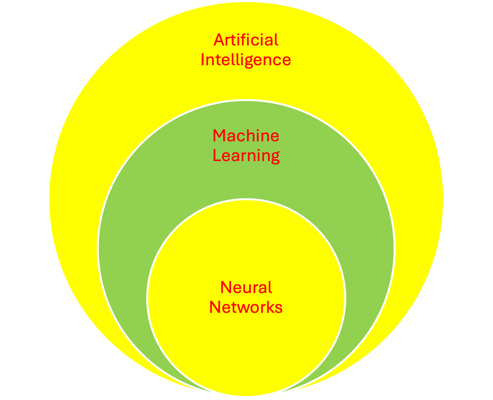

# Unit00-Overview
## Investigating Generative AI in Software Development

Description: Generative AI has the potential to significantly enhance developer productivity.
This course delves into how Microsoft Copilot can be used for various tasks, including code generation, chat assistance, refactoring, unit testing, data file manipulation, and documentation.
Examples will span multiple programming languages, such as Java and Python. Additionally, we'll explore ethical considerations (code ownership, privacy concerns, bias and fairness),
integration with existing tools (e.g. Git), and real-world use cases.

Prerequisites: While there is no formal prerequisite, it will be assumed that students have some
programming background. Specifically, each student should already be familiar with concepts such as variables, data types, iteration, and functions in at least one programming language (not necessarily limited to Python or Java).

—-------------------------------------------------------------------------------------------------------

Schedule: Weekend micro courses could be offered near the beginning of the fall and spring semesters.

Proposal: We propose creating lab exercises that introduce LLM generated code and other artifacts using Copilot running in an IDE for Python and for Java. Each unit will have a similar structure: an introduction, a compelling use case, several solved examples using Copilot, critical evaluations of those examples, student exercises similar to the examples, and references. The examples and exercises will range from easy beginner problems to more moderate problems, with a few complicated problems that will illustrate the limitations of using Copilot.

Details: Each of the three of us will work on several units separately but with input from each other as needed. We will use github as a repository for the materials to allow collaboration and later to facilitate student access. If there's interest, these materials could be used by other instructors at Heinz.

The list of units follows. We will complete the first four parts this summer.  The other parts are not immediately useful in intro Python and Java courses; they are more applicable to distributed systems and other courses.

The three of us are willing to co-teach a micro course on this material in the fall and spring semesters. Each of us would cover several units from the topics below.

—---------------------------------------------------------------------------------------------------------------------

Part 1. Introduction
Unit 1. Environment setup: IDE and Copilot. IntelliJ setup VScode and/or PyCharm setup
Unit 2. Problem solving and generating pseudocode from problem statements

Part 2. Programming
Unit 3. Java examples
Unit 4. Python examples
Unit 5. Generating documentation from code and code from documentation

Part 3. Testing
Unit 6. JUnit for Java
Unit 7. Pytest for Python

Part 4. Common Data Formats
Unit 8. JSON
Unit 9.  HTML
Unit 10. XML
Unit 11. CSV

Part 5. Distributed Systems
Unit 12. Client side proxy examples
Unit 13. Server side coding in Java
Unit 14. Peer to peer coding
Unit 15. Designing REST APIs
Unit 16. Detecting security vulnerabilities in client server code

Part 6. Software engineering
Unit 17. Generate SE artifacts - UML, and architecture diagrams
Unit 18. Container deployment
Unit 19. Refactor code by introducing design patterns into existing code

Part 7. Machine Learning
Unit 20. Generate Python code that uses AI libraries

Part 8. Other Topics
Unit 21. C++ Examples
Unit 22. Testing C++ with Google Test and Boost
Unit 23. Javascript Examples
Unit 24. Translating JavaScript to TypeScript
Unit 25. Testing Javascript with Mocha

# Readings

[Harnessing the Power of Generative AI in Transforming Software Engineering Productivity](https://zinnov.com/digital-technologies/generative-ai-in-software-engineering-transforming-productivity-whitepaper/)

[A Prompt Pattern Catalog to Enhance Prompt Engineering with ChatGPT](https://arxiv.org/abs/2302.11382)

[A Paper critical of this approach](https://www.cio.com/article/3540579/devs-gaining-little-if-anything-from-ai-coding-assistants.html)

# Where does Copilot fit?

# Notes

Software development involves specifying, designing, programming, documenting, testing, and maintaining applications.

In this repository, we will experiment with how Copilot might assist in the software development process.

Always keep in mind: "A fool with a tool is still a fool." - Grady Booch

AI pioneer and ACM A.M. Turing Award laureate Yann LeCun says some experts are exaggerating AI's power and risks. LeCun believes today’s AI models lack the intelligence of pets. When an OpenAI researcher stressed the need to control ultra-intelligent AI, LeCun responded, “It seems to me that before ‘urgently figuring out how to control AI systems much smarter than us’ we need to have the beginning of a hint of a design for a system smarter than a house cat."

# GitHub Mechanics: Updating a Unit

1) Do this once: Download the repository into a new directory named List-of-Units. This will create the
directory for you.

git clone --depth 1 --branch master https://github.com/Gen-AI-In-Software-Development/List-Of-Units List-Of-Units

git clone https://<personal_access_token>@github.com/Gen-AI-In-Software-Development/List-Of-Units.git

2) Do this every time you want to work on a unit:

Make changes to the README.md file in the unit that you are working on. Avoid other units.
Here, I assume your unit has the name MyModifiedUnit.

3) You are done making changes. You now want to add and commit your changes locally. Do this from
above the directory MyModifiedUnit.

git add MyModifiedUnit

git commit -m "Made improvements to my unit"

4) We want to upload changes. But first, get a (possibly updated) copy of the repository.
We need to work above the directory with the unit. We want to work in the List-Of-Units Directory.
These lines are only useful if another person has updated the repo. They are OK to
do if no changes were made by another person.

git fetch origin

git merge origin/master -m "Some good commit message here"

5) Now, push the changes that you have made:

git push origin master

6) Goto step 2.

# RESPONSE FROM COMPUTING SERVICES

Michael,

I did some searching through the IntelliJ Plugin marketplace. Unfortunately a lot of these companies are calling their products "Copilot", but they are often completely different products.

GitHub Copilot is probably the plugin you are thinking of, as it is the flagship model for coding now. Confusingly, even though it is owned by Microsoft, GH Copilot is not the same thing as Microsoft Copilot (formerly Bing Chat Enterprise). The latter is what CMU has a license for. I cannot find any Microsoft Copilot plugins for IntelliJ.

As for whether you can use Copilot in Edge for coding, I think that could work. It depends on how the code is rendered in the browser. Copilot in Edge can be "context aware" and read the content of the currently open web page, but it does not work for ALL content. Refer to this documentation from Microsoft about what content might be "invisible" to Copilot:
https://learn.microsoft.com/en-us/DeployEdge/edge-learnmore-copilot-page-summary-results

I tested it with a private GitHub repository, and I can share what I learned. I opened a TypeScript .tsx file in the browser. Then I opened the copilot sidebar and gave an instruction to rewrite one of the functions and add a line to it. I found out that this worked but only if I explicitly said "Using the code on this page...." in my prompt.

Also a downside of this approach is that Copilot sessions are not saved, so if you accidentally close the sidebar you can lose your message history.

Finally, because you mention this being given to students in a teaching and learning context, I'd recommend reaching out to Judy Brooks at Eberly. They are implementing similar assessments of this technology in the classroom, and they may be able to help or provide some guidance.

Best,
Bo Powers

# FROM CMU PAGE ON Copilot

[CMU Copilot page](https://www.cmu.edu/computing/services/ai/copilot/index.html)

# Notes from SEI talk
Give the LLM a large undocumented program and have it generate a clear description of the code.

Check out glasp (a plugin for chrome) as a tutor or trainer

We have to teach how to read and evaluate code

Unit tests are needed. Now, we will see more of this with LLM's.

Other software engineering activities => Requirements documents from a large body of text, policy document analysis, code, looking for inconsistencies, architecture documents (may be incorrect with glossy beauty)

Test driven development with LLMs.

Good prompt engineering is a type of programming.

Risk assessment of introducing LLM code into a system

We have code coming from a potentially untrusted source. We have to be able to read and analyze code.

Fundamental principles of software engineering (abstractions, information hiding, etc) will not be going away.

Ethically sourced data for LLMs?

Douglas Schmidt has videos. Know how to do prompt engineering and providing context.

Prompt Patterns are important: https://www.dre.vanderbilt.edu/~schmidt/PDF/prompt-patterns.pdf
Prompt engineering utube channel: https://www.youtube.com/@DouglasSchmidt
The programmer still needs to take ownership of the code in, say, safety critical systems.
