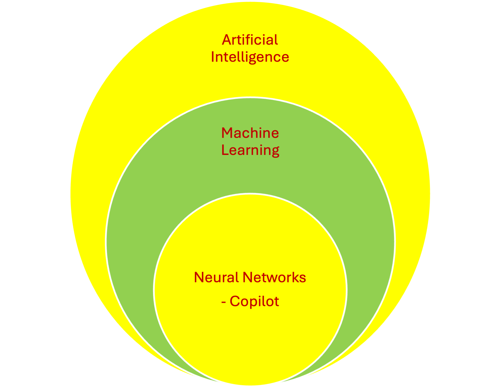

# Unit00-Overview
## Learning Generative AI in Software Development

Description: Generative AI has the potential to significantly enhance developer productivity. This micro-mini course delves into how Microsoft Copilot can be used for various tasks, including code generation, chat assistance, refactoring, unit testing, data file manipulation, and documentation. Examples will span multiple programming languages, such as Java, Python, and Javascript. The course will be hands-on and involve teamwork. Everyone will need a laptop to run code. There will be pre-work to set up your environment and post-work to include a short (1-to-3 page) paper.

Prerequisites: While there is no formal prerequisite, it will be assumed that students have some programming background. Specifically, each student should already be familiar with concepts such as variables, data types, iteration, and functions in at least one programming language (not necessarily limited to Python or Java).

Units: There are 28 units covering different topics in computer science and software engineering.

The list of units is broken down into 8 parts. The parts and units follow:

## Part 0. Introduction

Unit 0. [Overview: Description, pre-requisites, and readings](../Unit00-Overview)

Unit 1. [Environment setup: IDE and Copilot. IntelliJ setup VScode and/or PyCharm setup](../Unit01-Environment-Setup)

## Part 1. Programming

Unit 2. [Problem solving and generating pseudocode from problem statements](../Unit02-Problem-Soving-And-Pseudocode)

Unit 3. [Java examples](../Unit03-Java-Examples)

Unit 4. [Python examples](../Unit04-Python-Examples)

Unit 5. [Generating documentation from code and code from documentation](../Unit05-Generating-Documentation-From-Code-And-Code-From-Documentation)

## Part 2. Testing

Unit 6. [JUnit for Java](../Unit06-JUnit-For-Java)

Unit 7. [Pytest for Python](../Unit07-Pytest-For-Python)

## Part 3. Common Data Formats

Unit 8. [JSON](../Unit08-JSON)

Unit 9. [HTML](../Unit09-HTML)

Unit 10. [XML](../Unit10-XML)

Unit 11. [CSV](../Unit11-CSV)

## Part 4. Distributed Systems

Unit 12. [Client side proxy examples](../Unit12-Client-Side-Proxy-Examples)

Unit 13. [Server side coding in Java](../Unit13-Server-Side-Coding-In-Java)

Unit 14. [Peer to peer coding](../Unit14-Peer-To-Peer-Coding)

Unit 15. [Designing REST APIs](../Unit15-Designing-REST-APIs)

## Part 5. Software engineering

Unit 16. [Generate SE artifacts - UML, and architecture diagrams](../Unit16-Generating-SE-Artifacts-UML-and-Architecture-Diagrams)

Unit 17. [Container deployment](../Unit17-Container-Deployment)

Unit 18. [Refactor code by introducing design patterns into existing code](../Unit18-Refractor-Code-By-Introducing-Design-Patterns-Into-Existing-Code)

## Part 6. Machine Learning

Unit 19. [Generate Python code that uses AI libraries](../Unit19-Generate-Python-Code-That-Uses-AI-Libraries)

Unit 20. [Building a neural network in Java](../Unit20-Neural_Network_in_Java)

## Part 7. Data Structures and Algorithms

Unit 21. [Data Structures and Algorithms](../Unit21-Data-Structures-And-Algorithms)

## Part 8. Other Topics

Unit 22. [C++ Examples](../Unit22-C++-Examples)

Unit 23. [Theoretical Computer Science](../Unit23-Theoretical-Computer-Science)

Unit 24. [JavaScript Examples](../Unit24-JavaScript-Examples)

Unit 25. [Translating JavaScript to TypeScript](../Unit25-Translating-JavaScript-To-TypeScript)

Unit 26. [Detecting security vulnerabilities in client server code](../Unit26-Detecting-Security-Vulnerablities-In-Client-Server-Code)

Unit 27. [Cloud Computing](../Unit27-Cloud-Computing)

Unit 28. [Prompt Patterns](../Unit28-Prompt-Patterns)

# Papers

[Harnessing the Power of Generative AI in Transforming Software Engineering Productivity](https://zinnov.com/digital-technologies/generative-ai-in-software-engineering-transforming-productivity-whitepaper/)

[A Prompt Pattern Catalog to Enhance Prompt Engineering with ChatGPT](https://arxiv.org/abs/2302.11382)

[A Paper critical of the AI approach](https://www.cio.com/article/3540579/devs-gaining-little-if-anything-from-ai-coding-assistants.html)

[Beyond Traditional Teaching](papers/3626252.3630789.pdf)

[Prompt Problems: A New Programming Exercise for the Generative AI Era](papers/3626252.3630909.pdf)

[ChatGPT in the classroom](papers/3626252.3630803.pdf)

[Teaching CS50 with AI](papers/3626252.3630938.pdf)

# Where does Copilot fit?

# Quotes

"A fool with a tool is still a fool." - Grady Booch

AI pioneer and ACM A.M. Turing Award laureate Yann LeCun says some experts are exaggerating AI's power and risks. LeCun believes today’s AI models lack the intelligence of pets. When an OpenAI researcher stressed the need to control ultra-intelligent AI, LeCun responded, “It seems to me that before ‘urgently figuring out how to control AI systems much smarter than us’ we need to have the beginning of a hint of a design for a system smarter than a house cat."

"The programmer needs to take ownership of code in, say, safety
critical systems." - Overheard at an SEI workshop

Developers also have growing concerns over the potential for AI assistants to suggest or propagate vulnerable code. While the majority of developers (56%) expect AI assistants to provide usable code, only 23% expect the code to be secure, while a larger group (40%) don't believe AI assistants provide secure code at all, according to research by software development firm JetBrains and the University of California at Irvine, published in June, 2024.

# GitHub Mechanics: Updating a Unit

1) Do this once: Download the repository into a new directory named List-of-Units. This will create the
directory for you.

git clone --depth 1 --branch master https://github.com/Gen-AI-In-Software-Development/List-Of-Units List-Of-Units

git clone https://<personal_access_token>@github.com/Gen-AI-In-Software-Development/List-Of-Units.git

2) Do this every time you want to work on a unit:

Make changes to the README.md file in the unit that you are working on. Avoid other units.
Here, I assume your unit has the name MyModifiedUnit.

3) You are done making changes. You now want to add and commit your changes locally. Do this from
above the directory MyModifiedUnit.

git add MyModifiedUnit

git commit -m "Made improvements to my unit"

4) We want to upload changes. But first, get a (possibly updated) copy of the repository.
We need to work above the directory with the unit. We want to work in the List-Of-Units Directory.
These lines are only useful if another person has updated the repo. They are OK to
do if no changes were made by another person.

git fetch origin

git merge origin/master -m "Some good commit message here"

5) Now, push the changes that you have made:

git push origin master

6) Goto step 2.

# CMU PAGE ON Copilot

[CMU Copilot page](https://www.cmu.edu/computing/services/ai/copilot/index.html)
