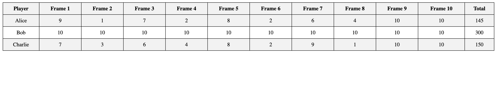
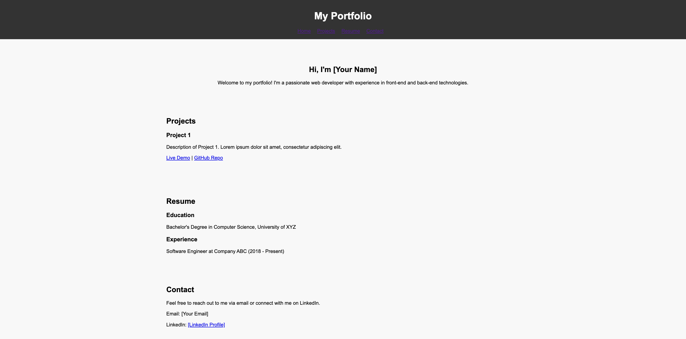
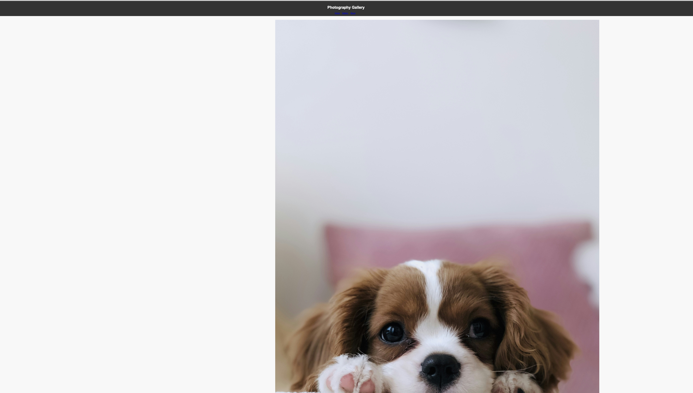
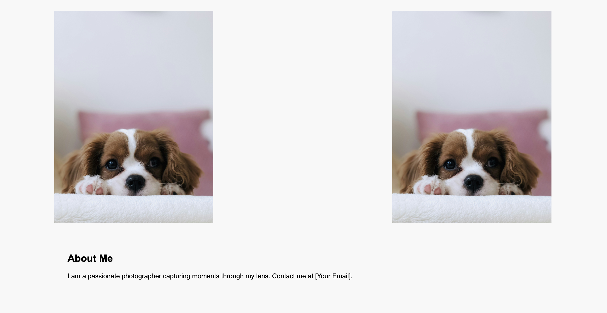
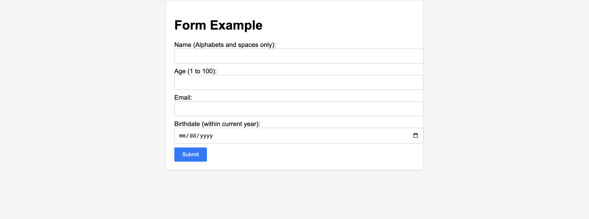
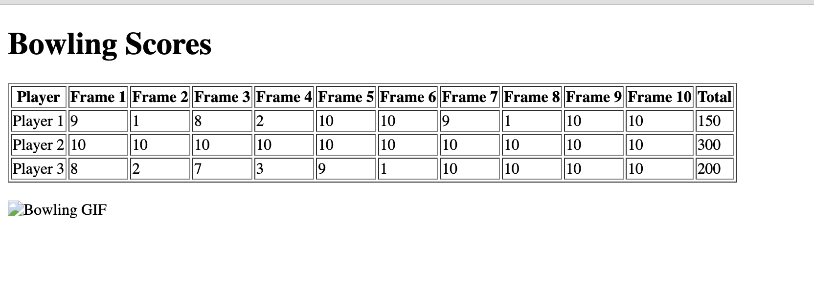
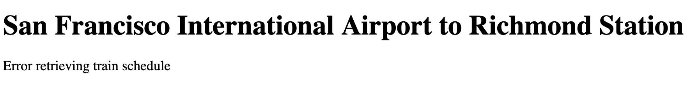

#  Unit09-HTML
## Introduction
In this unit, we’ll explore various HTML examples generated by Microsoft Copilot. Our goal is to review the code produced and provide constructive feedback to ensure best practices and effective usage of HTML elements and structures.

These examples use Microsoft copilot provided here: [Microsoft copilot](https://copilot.microsoft.com/).

## Use Case
HTML (HyperText Markup Language) is the foundational language for creating web pages and web applications. It defines the structure and layout of a webpage by using a variety of tags and attributes. HTML is not a programming language; it is a markup language that organizes content for the web.

HTML’s versatility makes it essential for web development, enabling the integration of text, images, multimedia, and interactive forms. It is also used in conjunction with CSS (Cascading Style Sheets) for styling and JavaScript for functionality, creating comprehensive and dynamic web experiences. Additionally, HTML plays a critical role in email templates, mobile app development through frameworks like Apache Cordova, and content management systems like WordPress and SharePoint.

In this unit, we will create various HTML examples and leverage Copilot to assist in demonstrating different HTML elements, attributes, and best practices.

## Prompts and Code Critique
We will show each prompt and the resulting code generated by Copilot. We will follow each example with a short critique and rating. The ratings will be Poor, Fair, or Good.


### Prompt 9.1 : Generate an HTML page that displays the scores of a bowling game for multiple players. Each player should have their scores for each frame displayed, along with a total score at the end. The layout should include a table with player names as rows and frames as columns, with the last column showing the total score for each player. Please include sample data for three players with ten frames each.Please generate code for all ten frames

### Generated HTML
```
<!DOCTYPE html>
<html>
<head>
    <style>
        table {
            border-collapse: collapse;
            width: 100%;
        }
        th, td {
            border: 1px solid black;
            padding: 8px;
            text-align: center;
        }
        th {
            background-color: #f2f2f2;
        }
        tr:nth-child(even) {
            background-color: #f2f2f2;
        }
    </style>
</head>
<body>
    <table>
        <tr>
            <th>Player</th>
            <th>Frame 1</th>
            <th>Frame 2</th>
            <th>Frame 3</th>
            <th>Frame 4</th>
            <th>Frame 5</th>
            <th>Frame 6</th>
            <th>Frame 7</th>
            <th>Frame 8</th>
            <th>Frame 9</th>
            <th>Frame 10</th>
            <th>Total</th>
        </tr>
        <tr>
            <td>Alice</td>
            <td>9</td>
            <td>1</td>
            <td>7</td>
            <td>2</td>
            <td>8</td>
            <td>2</td>
            <td>6</td>
            <td>4</td>
            <td>10</td>
            <td>10</td>
            <td>145</td>
        </tr>
        <tr>
            <td>Bob</td>
            <td>10</td>
            <td>10</td>
            <td>10</td>
            <td>10</td>
            <td>10</td>
            <td>10</td>
            <td>10</td>
            <td>10</td>
            <td>10</td>
            <td>10</td>
            <td>300</td>
        </tr>
        <tr>
            <td>Charlie</td>
            <td>7</td>
            <td>3</td>
            <td>6</td>
            <td>4</td>
            <td>8</td>
            <td>2</td>
            <td>9</td>
            <td>1</td>
            <td>10</td>
            <td>10</td>
            <td>150</td>
        </tr>
    </table>
</body>
</html>

```

The browser display appears next.

-----



-----


### Critique
The HTML code effectively displays a bowling game scoreboard with player names, frame scores, and total scores in a well-structured table. The use of CSS for table styling and alternating row colors enhances readability and visual appeal.
Rating: Good

### Prompt 9.2 : I need a personal portfolio website to showcase my resume, projects, skills, and contact information. The website should have a home page with an introduction and summary, a projects page with descriptions, images, and links to live demos or GitHub repositories, a resume page with education, experience, and skills, and a contact form with email and social media links. Please create the HTML structure and include placeholder content for each section.

### Generated HTML
```
<!DOCTYPE html>
<html lang="en">
<head>
    <meta charset="UTF-8">
    <meta name="viewport" content="width=device-width, initial-scale=1.0">
    <title>My Portfolio</title>
    <style>
        /* Add your custom CSS styles here */
        body {
            font-family: Arial, sans-serif;
            margin: 0;
            padding: 0;
            background-color: #f8f8f8;
        }
        header {
            background-color: #333;
            color: #fff;
            text-align: center;
            padding: 1rem;
        }
        nav ul {
            list-style: none;
            padding: 0;
            margin: 0;
        }
        nav ul li {
            display: inline-block;
            margin-right: 1rem;
        }
        .container {
            max-width: 1200px;
            margin: 0 auto;
            padding: 2rem;
        }
        .intro {
            text-align: center;
            padding: 2rem;
        }
        .projects {
            padding: 2rem;
        }
        .project {
            margin-bottom: 2rem;
        }
        .resume {
            padding: 2rem;
        }
        .contact {
            padding: 2rem;
        }
    </style>
</head>
<body>
    <header>
        <h1>My Portfolio</h1>
        <nav>
            <ul>
                <li><a href="#home">Home</a></li>
                <li><a href="#projects">Projects</a></li>
                <li><a href="#resume">Resume</a></li>
                <li><a href="#contact">Contact</a></li>
            </ul>
        </nav>
    </header>
    <div class="container">
        <section id="home" class="intro">
            <h2>Hi, I'm [Your Name]</h2>
            <p>Welcome to my portfolio! I'm a passionate web developer with experience in front-end and back-end technologies.</p>
        </section>
        <section id="projects" class="projects">
            <h2>Projects</h2>
            <div class="project">
                <h3>Project 1</h3>
                <p>Description of Project 1. Lorem ipsum dolor sit amet, consectetur adipiscing elit.</p>
                <a href="#">Live Demo</a> | <a href="#">GitHub Repo</a>
            </div>
            <!-- Add more project sections as needed -->
        </section>
        <section id="resume" class="resume">
            <h2>Resume</h2>
            <h3>Education</h3>
            <p>Bachelor's Degree in Computer Science, University of XYZ</p>
            <h3>Experience</h3>
            <p>Software Engineer at Company ABC (2018 - Present)</p>
            <!-- Add more resume sections as needed -->
        </section>
        <section id="contact" class="contact">
            <h2>Contact</h2>
            <p>Feel free to reach out to me via email or connect with me on LinkedIn.</p>
            <p>Email: [Your Email]</p>
            <p>LinkedIn: <a href="[LinkedIn Profile URL]">[LinkedIn Profile]</a></p>
        </section>
    </div>
</body>
</html>
```

The browser display appears next.


-----



-----


### Critique
The HTML code provides a well-structured and organized layout for a portfolio page, including navigation links and sections for projects, resume, and contact information. However, the code lacks any interactive features or advanced styling techniques and the menu items, while working, are almost impossible to read. This is quite basic but provides a starting point.

Rating: Fair

### Prompt 9.3 : I need an HTML page for a Photography Gallery that includes the following features: A home page with a featured photo or a slideshow. Gallery pages with thumbnail images that open in lightbox pop-ups for full-size views. Categories or albums to organize different types of photography. An About page with the photographer’s bio and contact information. Please include sample data for photos and bio information. Can you add different photos from Unsplash and adjust the size of pictures to fit 1920x1080 screen resolution

### Generated HTML
```
<!DOCTYPE html>
<html lang="en">
<head>
    <meta charset="UTF-8">
    <meta name="viewport" content="width=device-width, initial-scale=1.0">
    <title>Photography Gallery</title>
    <style>
        /* Add your custom CSS styles here */
        body {
            font-family: Arial, sans-serif;
            margin: 0;
            padding: 0;
            background-color: #f8f8f8;
        }
        header {
            background-color: #333;
            color: #fff;
            text-align: center;
            padding: 1rem;
        }
        nav ul {
            list-style: none;
            padding: 0;
            margin: 0;
        }
        nav ul li {
            display: inline-block;
            margin-right: 1rem;
        }
        .container {
            max-width: 1200px;
            margin: 0 auto;
            padding: 2rem;
        }
        .featured-photo {
            text-align: center;
            margin-bottom: 2rem;
        }
        .gallery {
            display: flex;
            flex-wrap: wrap;
            justify-content: space-between;
        }
        .gallery-item {
            width: calc(33.33% - 1rem);
            margin-bottom: 1rem;
        }
        .gallery-item img {
            width: 100%;
            height: auto;
            cursor: pointer;
        }
        .lightbox {
            display: none;
            position: fixed;
            top: 0;
            left: 0;
            width: 100%;
            height: 100%;
            background-color: rgba(0, 0, 0, 0.8);
            z-index: 999;
        }
        .lightbox img {
            max-width: 80%;
            max-height: 80%;
            position: absolute;
            top: 50%;
            left: 50%;
            transform: translate(-50%, -50%);
        }
        .about {
            padding: 2rem;
        }
    </style>
</head>
<body>
    <header>
        <h1>Photography Gallery</h1>
        <nav>
            <ul>
                <li><a href="#home">Home</a></li>
                <li><a href="#gallery">Gallery</a></li>
                <li><a href="#about">About</a></li>
            </ul>
        </nav>
    </header>
    <div class="container">
        <section id="home" class="featured-photo">
            
        </section>
        <section id="gallery" class="gallery">
            <div class="gallery-item">
                
            </div>
            <div class="gallery-item">
                
            </div>
            <!-- Add more gallery items as needed -->
        </section>
        <div class="lightbox" id="lightbox">
            
        </div>
        <section id="about" class="about">
            <h2>About Me</h2>
            <p>I am a passionate photographer capturing moments through my lens. Contact me at [Your Email].</p>
        </section>
    </div>
    <script>
        function openLightbox(photoUrl) {
            const lightbox = document.getElementById('lightbox');
            const lightboxImg = document.getElementById('lightbox-img');
            lightboxImg.src = photoUrl;
            lightbox.style.display = 'block';
        }
    </script>
</body>
</html>

```

The browser display appears next.

----



----


Another browser display:

-----



-----


### Critique
The provided HTML code for the Photography Gallery is structurally sound and demonstrates good use of HTML and CSS for layout and styling. However The featured photo is not sized properly and can appear stretched or not fit well in the designated area. The menu, along the top of the page, works well but due to the coloring, is almost impossible to read.

Rating: Fair

### Prompt 9.4 :Create an HTML page that includes a form with the following features: A text input field that only accepts alphabets and spaces. A number input field that only accepts numbers within a specific range (e.g., 1 to 100). An email input field with basic validation. A date input field that only allows selecting a date within the current year.A submit button that displays an alert with the form data when clicked.

### Generated HTML
```
<!DOCTYPE html>
<html>
<head>
    <title>Form Example</title>
    <style>
        /* Add some basic styling */
        body {
            font-family: Arial, sans-serif;
            margin: 0;
            padding: 0;
            background-color: #f5f5f5;
        }
        .container {
            max-width: 600px;
            margin: 0 auto;
            padding: 20px;
            background-color: #ffffff;
            border-radius: 5px;
            box-shadow: 0 2px 4px rgba(0, 0, 0, 0.1);
        }
        input[type="text"], input[type="number"], input[type="email"], input[type="date"] {
            width: 100%;
            padding: 10px;
            margin-bottom: 10px;
            border: 1px solid #ccc;
            border-radius: 3px;
        }
        input[type="submit"] {
            background-color: #007bff;
            color: #ffffff;
            border: none;
            border-radius: 3px;
            padding: 10px 20px;
            cursor: pointer;
        }
    </style>
</head>
<body>
    <div class="container">
        <h1>Form Example</h1>
        <form id="myForm">
            <label for="name">Name (Alphabets and spaces only):</label>
            <input type="text" id="name" name="name" pattern="[A-Za-z ]+" required>
            <br>
            <label for="age">Age (1 to 100):</label>
            <input type="number" id="age" name="age" min="1" max="100" required>
            <br>
            <label for="email">Email:</label>
            <input type="email" id="email" name="email" required>
            <br>
            <label for="birthdate">Birthdate (within current year):</label>
            <input type="date" id="birthdate" name="birthdate" max="2023-12-31" required>
            <br>
            <input type="submit" value="Submit">
        </form>
    </div>
    <script>
        document.getElementById("myForm").addEventListener("submit", function(event) {
            event.preventDefault();
            const formData = new FormData(event.target);
            const formObject = {};
            formData.forEach((value, key) => {
                formObject[key] = value;
            });
            alert(JSON.stringify(formObject, null, 2));
        });
    </script>
</body>
</html>
```

The browser display appears next.

-----



-----


### Critique
This code provides a well-structured form with clear input validations and a visually appealing layout. The use of pattern attributes and type-specific input fields ensures that only restricted input is accepted, making it robust and user-friendly.

Rating: Good

### Prompt 9.5 : Generate an HTML page that displays the scores of a bowling game for multiple players. Each player should have their scores for each frame displayed, along with a total score at the end. The layout should include a table with player names as rows and frames as columns, with the last column showing the total score for each player. Please include sample data for three players with ten frames each.Please generate code for all ten frames. Add a GIF from web related to bowling below the table

### Generated HTML
```
<!DOCTYPE html>
<html>
<head>
    <title>Bowling Scores</title>
</head>
<body>
    <h1>Bowling Scores</h1>
    <table border='1'>
        <tr>
            <th>Player</th>
            <th>Frame 1</th>
            <th>Frame 2</th>
            <th>Frame 3</th>
            <th>Frame 4</th>
            <th>Frame 5</th>
            <th>Frame 6</th>
            <th>Frame 7</th>
            <th>Frame 8</th>
            <th>Frame 9</th>
            <th>Frame 10</th>
            <th>Total</th>
        </tr>
        <tr>
            <td>Player 1</td>
            <td>9</td>
            <td>1</td>
            <td>8</td>
            <td>2</td>
            <td>10</td>
            <td>10</td>
            <td>9</td>
            <td>1</td>
            <td>10</td>
            <td>10</td>
            <td>150</td>
        </tr>
        <tr>
            <td>Player 2</td>
            <td>10</td>
            <td>10</td>
            <td>10</td>
            <td>10</td>
            <td>10</td>
            <td>10</td>
            <td>10</td>
            <td>10</td>
            <td>10</td>
            <td>10</td>
            <td>300</td>
        </tr>
        <tr>
            <td>Player 3</td>
            <td>8</td>
            <td>2</td>
            <td>7</td>
            <td>3</td>
            <td>9</td>
            <td>1</td>
            <td>10</td>
            <td>10</td>
            <td>10</td>
            <td>10</td>
            <td>200</td>
        </tr>
    </table>
    <br>
    
</body>
</html>
```

The browser display appears next.



----


### Critique
This HTML code provides a clear and structured table for displaying bowling scores of multiple players, along with their total scores. However, the GIF link is incorrect and does not properly display an image, which detracts from the visual appeal of the page.

Rating: Poor

### Prompt 9.6 :The Bay Area Rapid Transit (BART) API allows us to make queries for the time it takes for a train to arrive at a particular stop enroute to a particular destination. I would like an HTML web page that makes periodic visits to the BART legacy API. I am interested in the next train to arrive at the San Francisco International Airport and destined for the Richmond station. The periodic updates will show the time a traveler needs to wait at the airport station for a train destined for the Richmond station. Of course, the time should lower as the train approaches. If no train is coming the web page will display the string "No Train Coming".

### Generated HTML
```
<!DOCTYPE html>
<html lang="en">
<head>
<meta charset="UTF-8">
<meta name="viewport" content="width=device-width, initial-scale=1.0">
<title>BART Train Schedule</title>
<script src="https://code.jquery.com/jquery-3.6.0.min.js"></script>
<script>
// Function to call the BART API and update the page
function updateTrainSchedule() {
    $.ajax({
        url: 'https://api.bart.gov/api/etd.aspx?cmd=etd&orig=SFO&dest=RICH&key=YOUR_BART_API_KEY',
        type: 'GET',
        dataType: 'xml',
        success: function(response) {
            // Parse the XML response
            var xmlDoc = $.parseXML(response),
                $xml = $(xmlDoc),
                $etd = $xml.find('etd');

            // Check if there is an estimated time available
            if ($etd.length > 0) {
                var nextTrain = $etd.first().find('estimate').first().find('minutes').text();
                $('#trainSchedule').text('Next train to Richmond in: ' + nextTrain + ' minutes');
            } else {
                $('#trainSchedule').text('No Train Coming');
            }
        },
        error: function() {
            $('#trainSchedule').text('Error retrieving train schedule');
        }
    });
}

// Set the interval for updates (e.g., every 30 seconds)
setInterval(updateTrainSchedule, 30000);
</script>
</head>
<body onload="updateTrainSchedule()">
<h1>San Francisco International Airport to Richmond Station</h1>
<div id="trainSchedule">Checking train schedule...</div>
</body>
</html>
```

### Critique

The first visit using this web page caused an error because the API Key was not included. That was
expected because an API Key should be established separately. When the API Key was provided, the
web page showed the error "Error retrieving train schedule". This error required a debugging effort.
The code used in the HTML for the San Fransisco station was SFO. This needed to be changed to
SFIA. After that change, we received the message "No Train Coming". But, after running a correct
program, we learned that there was a train coming (in 6 minutes).

The browser display appears next.

-----



-----

The timing system worked in the web page. After 30 seconds, a new request was made. After debugging
with console.log statements, it was discovered that the etd variable was always 0 after each fetch.

The resulting HTML page is useful but significant debugging is still required.

Rating: Poor

## Exercises
1.	For Prompt 9.1, ask Copilot to implement a JavaScript function that calculates and updates the total scores for each player when the button is clicked.
2.	Use Microsoft Copilot to generate an HTML page that includes:
	•	An image from an external source (e.g., Unsplash, Pixabay).
	•	An embedded YouTube video.
	•	An embedded Google Maps location.
3. 	Use Microsoft Copilot to generate an HTML page that includes:
	•	A button that shows/hides additional content when clicked.
	•	A dropdown menu that filters content on the page.
	•	A modal window that displays additional information when triggered.
4.  Use Microsoft Copilot to create an HTML table that displays dynamic data fetched from an API. Use JavaScript to fetch data from a public API (e.g., JSONPlaceholder, OpenWeatherMap) and populate the table with the retrieved data.
5. Using Copilot for assistance, debug the generated HTML of 9.6 so that it visits BART and works as described in the prompt. You will need to get an API key from the Bay Area Rapid Transit system.
