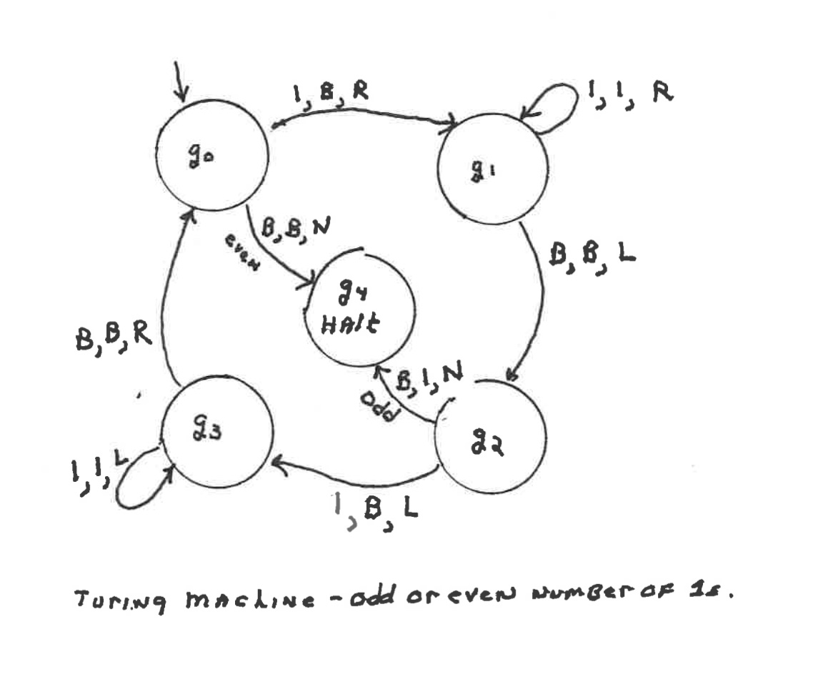
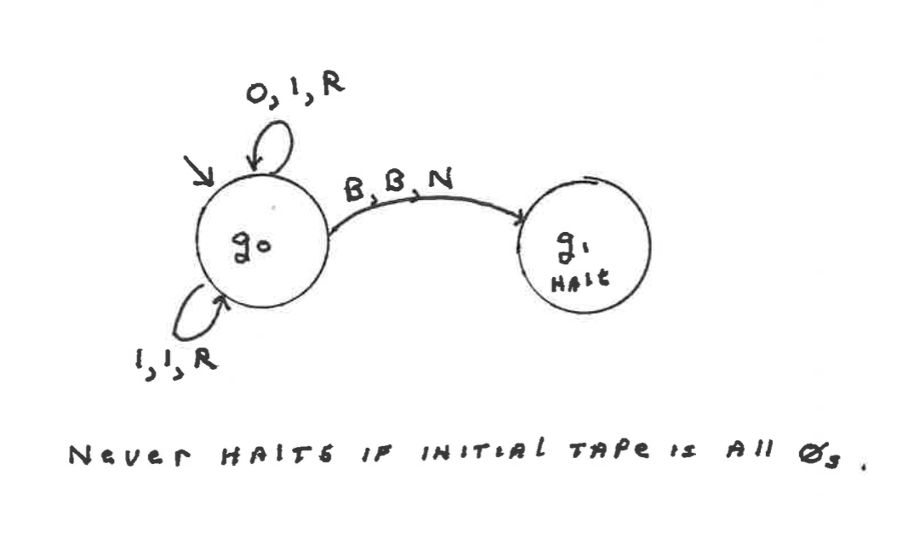

#  Unit23-Theoretical-Computer Science

## Introduction

In this unit, we will ask Copilot to generate some Turing machines and ask questions about theoretical computer science.

One of the goals of theoretical computer science is to understand the limits of computation. That is, what problems can be solved by algorithms and what problems cannot be solved by algorithms. In this unit, we consider a problem that can be solved and one that cannot.

These examples use Microsoft Copilot provided here: [Microsoft copilot](https://copilot.microsoft.com/).

## Prompts and Code Critique

We will show each prompt and the results generated by Copilot. We will follow each example with a short critique and rating. The ratings will be Poor, Fair, or Good.

## Use Case

The first example asks Copilot to create a simple Turing Machine to determine if an integer (expressed in unary notation) is even or odd.

### Example 23.1 prompt:
Design a Turing Machine which, started scanning the leftmost of an unbroken string of 1s on an otherwise blank tape, eventually halts, scanning a square on an otherwise blank tape - where the scanned square contains a blank or a 1 depending on whether there were an even or odd number of 1s in the original string.[1]

### Generated Response:
```
States and Symbols
States: ( q_0, q_1, q_2, q_3, q_4 )
Symbols: ( 1, B ) (where ( B ) represents a blank)
Transition Function
Initial State (( q_0 )):
If reading ( 1 ): Replace with ( B ), move right, go to ( q_1 ).
If reading ( B ): Halt, write ( B ) (even number of 1s).
State ( q_1 ):
If reading ( 1 ): Move right, stay in ( q_1 ).
If reading ( B ): Move left, go to ( q_2 ).
State ( q_2 ):
If reading ( 1 ): Replace with ( B ), move left, go to ( q_3 ).
If reading ( B ): Halt, write ( 1 ) (odd number of 1s).
State ( q_3 ):
If reading ( 1 ): Move left, stay in ( q_3 ).
If reading ( B ): Move right, go to ( q_0 ).
```
The solution can be drawn as shown:



### Critique
The proposed solution works as specified. We are assuming that q4 is the halt state. Rating: Good


## Use Case

The second example asks Copilot to work with a famous problem that has been shown to be incomputable - the Busy Beaver problem[2]. Before proceeding, be sure to study the Busy Beaver problem on Wikipedia (see the link in the references below). As noted in the article, the first few Busy Beavers are known. BB(0) = 0, BB(1) = 1, BB(2) = 4, BB(3) = 6, BB(4) = 13,
BB(5) = 4098. In general, the BB(n) is incomputable. Note that BB(1) is actually a 2-state Turing machine. One of the states is the halt state and goes uncounted.

In the example prompt, we do not mention the term "Busy Beaver" but only ask Copilot to solve the problem. See the exercises to go further.


### Example 23.2 prompt:
I would like for you to build a Turing machine using the following notation. Sigma is the alphabet. Sigma = { '0', '1' }. delta is the transition function. Q is the set of states, for example, Q = { q0, q1, ..., qn}. I would like for you to build a 2 state Turing machine that writes as many ones as possible on an initial tape with an infinity of 0s and then halts. The first state will be the start state, q0, and the other state will be the halt state, q1. It is important to me that that the machine halts after writing as many ones as possible. I need the delta transitions.

### Generated Response:
```
Sure, I can help with that! Here’s a Turing machine that writes as many ones as possible on an initially blank tape (filled with 0s) and then halts.

Turing Machine Components
Alphabet (Σ): { ‘0’, ‘1’ }
States (Q): { q0, q1 }
Start State: q0
Halt State: q1
Transition Function (δ)
The transition function δ can be defined as follows:

δ(q0, ‘0’) = (q0, ‘1’, R): In state q0, if the machine reads a ‘0’, it writes a ‘1’, moves right, and stays in state q0.
δ(q0, ‘1’) = (q0, ‘1’, R): In state q0, if the machine reads a ‘1’, it writes a ‘1’, moves right, and stays in state q0.
δ(q0, ‘B’) = (q1, ‘B’, N): In state q0, if the machine reads a blank (B), it transitions to the halt state q1 and does not move the tape head.
Explanation
The machine starts in state q0.
It writes ‘1’ over every ‘0’ it encounters and moves to the right.
When it encounters a blank (B), it transitions to the halt state q1 and stops.
This Turing machine will continue writing '1’s until it reaches the end of the tape, ensuring it writes as many ones as possible before halting.

If you have any more questions or need further assistance, feel free to ask!
```
The solution can be drawn as shown:



### Critique

The proposed solution does not work as specified. The initial tape has an infinity of 0s and so, there will never be a blank encountered. The machine will never halt. Rating:Poor

## Exercises
1. Ask Copilot to create a Turing Machine that adds two integers expressed in unary notation and separated by a blank.
2. Draw a state machine diagram showing BB(1).
3. See if you can get Copilot to generate a few Busy Beaver results.
4. Does mentioning the term "Busy Beaver" improve on Copilot's performance?

## References
[1] Computability and Logic, Boolos and Jeffrey, Cambridge University Press, second edition, pg. 26.

[2][The Busy Beaver problem is well explained on Wikipedia](https://en.wikipedia.org/wiki/Busy_beaver)
