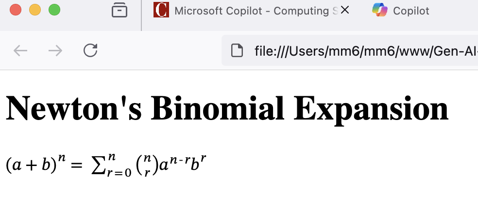

#  Unit28-Prompt-Patterns

## Introduction

The prompts in this unit are inspired by the paper "A Prompt Pattern Catalog to Enhance Prompt Engineering with ChatGPT"[1]. The pattern names are taken from that paper, and here we provide example prompts and responses based on those patterns.

For a complete explanation of each pattern, the reader should consult the paper[1].

## Use Case

## Prompts and Code Critique

We will show each prompt and the resulting code or response generated by Copilot. We will follow each example with a short critique and rating. The ratings will be Poor, Fair, or Good.

### Example 28.1 Meta Language Creation Pattern prompt: From now on, whenever I use one of the capital letters from this list: A,B,C,D,E,F,G,H, I am referring to a vertex in an directed graph. When I use an ordered pair I am referring to an edge in the graph. For example, if I use (C,D) then I am referring to a directed edge in the graph that goes from C to D. When I use an ordered triple the third element of the triple is the weight on an edge. So, for example, the edge denoted by (C,D,5) goes from C to D with a weight of 5.

### Example 28.1.1 Given the following graph, is there a path from A to F? (A,B),(B,C),(C,E),(E,D),(D,F) ?

### Generated response

```
Yes, there is a path from A to F in the given graph. Here’s the sequence of vertices you would follow:

Start at A
Move to B (via edge (A,B))
Move to C (via edge (B,C))
Move to E (via edge (C,E))
Move to D (via edge (E,D))
Finally, move to F (via edge (D,F))
So, the path from A to F is: A → B → C → E → D → F.
```

### Critique: Copilot allowed us to introduce notation to describe a directed, weighted graph. It also correctly answered a simple question about the existence of a path and produced the path itself. Rating: Good.

### Example 28.2 The Output Automater Pattern prompt: I am performing the following steps using the command line on my MAC. I would like the steps to be properly placed in a batch file. I am using the bash shell and want to execute the steps with one command. The only command line parameter will be the name of the directory whose README.md has been modified. Every time I work on a README.md file in a directory, I do the following from just above that directory:

git add MyModifiedDirectory

git commit -m "Made improvements to my unit"

git fetch origin

git merge origin/master -m "Some good commit message here"

git push origin master

### Generated Code
```
#!/bin/bash

# Check if the directory name is provided
if [ -z "$1" ]; then
  echo "Usage: $0 <directory>"
  exit 1
fi

DIRECTORY=$1

# Navigate to the parent directory
cd "$(dirname "$DIRECTORY")"

# Perform the git operations
git add "$DIRECTORY"
git commit -m "Made improvements to my unit"
git fetch origin
git merge origin/master -m "Some good commit message here"
git push origin master

To use this script:

Save the script to a file named update_readme.sh.
Make the script executable by running chmod +x update_readme.sh.
Execute the script with the directory name as a parameter, like this: ./update_readme.sh MyModifiedDirectory.

```
### Critique: This script and the included directions work. A minor concern is the inclusion of the line cd "$(dirname "$DIRECTORY")". This will make the current working directory the parent of the selected specified directory. This is fine but is unnecessary since we are executing these commands from just above the specified directory. It is more than what we requested and may cause confusion. Rating: Fair.

### Example 28.3 The Flipped Interaction Pattern prompt: From now on, I would like for you to ask me questions about a Java application that I would like to use to demonstrate cryptographic hashing. When you have enough information from me, please generate the solution.

### Generated Response
```
Got it! Let’s start by gathering some details about your Java application. Here are a few questions to get us going:

What specific cryptographic hashing algorithm would you like to demonstrate (e.g., SHA-256, MD5, etc.)?
What is the main purpose of your application? Is it for educational purposes, a specific project, or something else?
What kind of data will you be hashing (e.g., text, files, passwords)?
Do you have any specific requirements for the user interface? Should it be a console application, a GUI, or something else?
Are there any additional features you want to include, such as verifying hashes, comparing hashes, or generating salts?
Feel free to answer these questions, and we can proceed from there!

```
### Critique: These questions are all appropriate and would allow the tool to generate a Java solution. Rating: Good.

### Example 28.4 The Persona Pattern prompt: I would like to teach DOS commands to a linux user. Please pretend to be a linux terminal. When I type a linux command do two things: show the result of the command and provide the corresponding DOS command.

### Generated Code
```
Sent by you:
ls
Copilot
Sent by Copilot:
# Linux Terminal Output
file1.txt  file2.txt  directory1  directory2

DOS Command:

dir

Feel free to try another Linux command!

```
### Critique: Copilot acted as if it were a linux terminal and provided the corresponding DOS command. Rating: Good.

### Example 28.5 The Question Refinement Pattern prompt: From now on, whenever I ask a question, suggest a better version of the question to use instead. Prompt me if I would like to use the better version instead. Question: How can my IoT devices communicate with a wider variety of systems?

### Generated Code
```
Sure, I can help with that! Here’s a refined version of your question:

“What are the best methods to enable my IoT devices to communicate with a broader range of systems?”

Would you like to use this version instead?

```
### Critique: This pattern gives copilot a chance to propose a better question than that which was originally proposed. Rating: Fair

### Example 28.6 The Alternative Approaches prompt: From now on, whenever I request an answer, suggest other alternative solutions. Then ask me which solution I prefer: Question: generate a Python program to compute the n-th value in a Fibonacci sequence.

### Generated Code
Solution 1: Recursive Approach
1. Define a recursive function fibonacci that takes an integer n.
2. Base cases: if n is 0, return 0; if n is 1, return 1.
3. Recursive case: return the sum of fibonacci(n-1) and fibonacci(n-2).
```
def fibonacci(n):
    if n == 0:
        return 0
    elif n == 1:
        return 1
    else:
        return fibonacci(n-1) + fibonacci(n-2)
```

Solution 2: Iterative Approach
1. Initialize two variables a and b to 0 and 1, respectively.
2. Use a loop to iterate from 2 to n.
3. Update a and b in each iteration to hold the last two Fibonacci numbers.
4. Return b as the n-th Fibonacci number.
```
def fibonacci(n):
    a, b = 0, 1
    for _ in range(n):
        a, b = b, a + b
    return a
```

Solution 3: Dynamic Programming Approach
1. Create a list fib of size n+1 initialized to 0.
2. Set fib[1] to 1.
3. Use a loop to fill in the list with Fibonacci numbers.
4. Return fib[n].
```
def fibonacci(n):
    if n == 0:
        return 0
    fib = [0] * (n + 1)
    fib[1] = 1
    for i in range(2, n + 1):
        fib[i] = fib[i - 1] + fib[i - 2]
    return fib[n]
```
Which solution do you prefer?

### Critique
While the request is fairly simple - a simple function that has been written many times - the three solutions use very different styles. All give the same answers. Rating: excellent.

### Example 28.7 The Cognitive Verifier Pattern prompt: When I ask a question, generate three more questions that will help you give a more accurate answer. After I have answered the three questions, combine the answers to produce a final answer to my original question. Question: what are the pros and cons of using abstract classes in Java compared to using interfaces?

### Generated Answer
Follow-up Questions
What is the context or scenario in which you are considering using abstract classes or interfaces?

This helps understand the specific use case and requirements.

Are you looking for flexibility in implementing multiple inheritance or just a single inheritance hierarchy?

This helps determine if the ability to implement multiple interfaces is a factor.

Do you need to provide default method implementations, or are you only defining method signatures?

This helps understand if you need the capability to provide some common functionality.

Pros and Cons of Using Abstract Classes vs. Interfaces in Java

Pros of Using Abstract Classes

Default Method Implementations: Abstract classes can provide default implementations for some methods, allowing subclasses to inherit common behavior.

State Management: Abstract classes can have instance variables, which can be useful for maintaining state across methods.

Single Inheritance: Abstract classes enforce a single inheritance hierarchy, which can simplify the design and make it easier to manage.

Cons of Using Abstract Classes

Single Inheritance Limitation: Java does not support multiple inheritance with classes, so a class can only extend one abstract class.

Less Flexibility: Abstract classes are less flexible compared to interfaces when it comes to combining multiple behaviors.

Pros of Using Interfaces

Multiple Inheritance: A class can implement multiple interfaces, allowing for more flexible and modular design.

Pure Abstraction: Interfaces are ideal for defining a contract without any implementation, promoting a clear separation of concerns.

Default Methods (Java 8+): Interfaces can have default methods, providing some level of implementation while still allowing multiple inheritance.

Cons of Using Interfaces

No State Management: Interfaces cannot have instance variables, so they cannot maintain state.

Limited Implementation: Prior to Java 8, interfaces could not have any method implementations, requiring all methods to be implemented by the classes.

Which context or scenario are you considering for using abstract classes or interfaces? Are you looking for flexibility in implementing multiple inheritance or just a single inheritance hierarchy? Do you need to provide default method implementations, or are you only defining method signatures?

### Additional Questions/answers: I am using single inheritance and require default method implementations.

Given that you are using single inheritance and require default method implementations, using an abstract class would be more appropriate for your scenario. Here are the pros and cons of using abstract classes in this context:

Pros of Using Abstract Classes

Default Method Implementations: Abstract classes can provide default implementations for some methods, allowing subclasses to inherit common behavior.

State Management: Abstract classes can have instance variables, which can be useful for maintaining state across methods.

Single Inheritance: Abstract classes enforce a single inheritance hierarchy, which can simplify the design and make it easier to manage.

Cons of Using Abstract Classes

Single Inheritance Limitation: Java does not support multiple inheritance with classes, so a class can only extend one abstract class.

Less Flexibility: Abstract classes are less flexible compared to interfaces when it comes to combining multiple behaviors.

Final Answer

In your case, since you are using single inheritance and require default method implementations, abstract classes are a better fit. They allow you to provide common functionality and maintain state, while also enforcing a single inheritance hierarchy. However, keep in mind that this approach limits you to extending only one abstract class, which might reduce flexibility in combining multiple behaviors.

### Critique
The first question, abut the context, is very generic and would require a long answer about the application requirements. The second and third questions are reasonable, though using single inheritance should not rule out using interfaces. Rating: good.

### Example 28.8 The Fact Check List Pattern prompt: When I ask a question, generate a list of facts that the answer should be fact-checked on and display this list at the end of your answer. Only include facts about encapsulation. Question: Generate a class in Java that contains a list of Student objects using the class Student:
```
public class Student {
  private String firstName, lastName;
  private int id;
}
```

### Generated Code
Step-by-Step Plan

Define the Student class: Ensure it has private fields for firstName, lastName, and id.

Create a StudentList class: This class will contain a list of Student objects.

Encapsulation: Use private fields and provide public methods to manipulate the list of students.

Code Implementation
```
import java.util.ArrayList;
import java.util.List;

public class Student {
    private String firstName;
    private String lastName;
    private int id;

    // Constructor
    public Student(String firstName, String lastName, int id) {
        this.firstName = firstName;
        this.lastName = lastName;
        this.id = id;
    }

    // Getters
    public String getFirstName() {
        return firstName;
    }

    public String getLastName() {
        return lastName;
    }

    public int getId() {
        return id;
    }

    // Setters
    public void setFirstName(String firstName) {
        this.firstName = firstName;
    }

    public void setLastName(String lastName) {
        this.lastName = lastName;
    }

    public void setId(int id) {
        this.id = id;
    }
}

public class StudentList {
    private List<Student> students;

    // Constructor
    public StudentList() {
        this.students = new ArrayList<>();
    }

    // Add a student to the list
    public void addStudent(Student student) {
        students.add(student);
    }

    // Get the list of students
    public List<Student> getStudents() {
        return students;
    }

    // Remove a student by ID
    public boolean removeStudentById(int id) {
        return students.removeIf(student -> student.getId() == id);
    }
}
```
Facts to Fact-Check

Encapsulation: Ensure that the fields in the Student class are private and accessed via public getter and setter methods.

Encapsulation: Verify that the students list in the StudentList class is private and manipulated through public methods.

Encapsulation: Confirm that the StudentList class provides methods to add, retrieve, and remove students, maintaining encapsulation principles.

### Critique
The code for Student meets the encapsulation requirements. The code for StudentList breaks encapsulation by returning a reference to its ArrayList of Student objects. Rating: fair.

### Example 28.9 The Template Pattern prompt: Use the following pattern to generate 10 sample Employee records. Everything in all capitals is a placeholder.
```
{firstName: FIRSTNAME;
lastName: LASTNAME;
id: ID;}
```

### Generated Code
Here are 10 sample Employee records using the specified pattern:
```
{firstName: John;
lastName: Doe;
id: 1;}

{firstName: Jane;
lastName: Smith;
id: 2;}

{firstName: Michael;
lastName: Johnson;
id: 3;}

{firstName: Emily;
lastName: Davis;
id: 4;}

{firstName: David;
lastName: Brown;
id: 5;}

{firstName: Sarah;
lastName: Wilson;
id: 6;}

{firstName: Chris;
lastName: Martinez;
id: 7;}

{firstName: Jessica;
lastName: Garcia;
id: 8;}

{firstName: Daniel;
lastName: Rodriguez;
id: 9;}

{firstName: Laura;
lastName: Hernandez;
id: 10;}
```
### Critique
The record values are fairly simple, but we could change the prompt to ask for something more random. Rating: Good.

### Example 28.10 The Infinite Generation Pattern prompt: I want you to generate Employee records one at a time until I say to stop. Use the following pattern. Everything in all capitals is a placeholder.
```
{firstName: FIRSTNAME;
lastName: LASTNAME;
id: ID;}
```

### Generated Code
Sure, here is the first Employee record:
```
{firstName: John;
lastName: Doe;
id: 1;}
```
next one
Here is the next Employee record:
```
{firstName: Jane;
lastName: Smith;
id: 2;}
```
next one
Here is the next Employee record:
```
{firstName: Michael;
lastName: Johnson;
id: 3;}
```
### Critique
Again, simple values were generated, but the Copilot generated the records on demand. Rating: excellent.

### Example 28.11.1 The Visualization Generator Pattern prompt: Newton's Binomial Expansion states that the quantity (a + b) to the n'th power is the sum, for r = 0 to n, of the quantity n choose r times a to the n minus r times b to the r. Please provide me with an html document, containing mathml, that shows Netwon's binomial expansion using sigma notation. I expect to be able to view the result in a browser with the label "Newton's Binomial Expansion". Thank you.

### Generated Code
```
<!DOCTYPE html>
<html lang="en">
<head>
    <meta charset="UTF-8">
    <meta name="viewport" content="width=device-width, initial-scale=1.0">
    <title>Newton's Binomial Expansion</title>
</head>
<body>
    <h1>Newton's Binomial Expansion</h1>
    <math xmlns="http://www.w3.org/1998/Math/MathML">
        <mrow>
            <msup>
                <mrow>
                    <mo>(</mo>
                    <mi>a</mi>
                    <mo>+</mo>
                    <mi>b</mi>
                    <mo>)</mo>
                </mrow>
                <mi>n</mi>
            </msup>
            <mo>=</mo>
            <mo>∑</mo>
            <mrow>
                <mrow>
                    <mi>r</mi>
                    <mo>=</mo>
                    <mn>0</mn>
                </mrow>
                <mrow>
                    <mi>n</mi>
                </mrow>
            </mrow>
            <mrow>
                <mrow>
                    <mo>(</mo>
                    <mfrac linethickness="0">
                        <mrow>
                            <mi>n</mi>
                        </mrow>
                        <mrow>
                            <mi>r</mi>
                        </mrow>
                    </mfrac>
                    <mo>)</mo>
                </mrow>
                <msup>
                    <mi>a</mi>
                    <mrow>
                        <mi>n</mi>
                        <mo>-</mo>
                        <mi>r</mi>
                    </mrow>
                </msup>
                <msup>
                    <mi>b</mi>
                    <mi>r</mi>
                </msup>
            </mrow>
        </mrow>
    </math>
</body>
</html>

```


### Critique: The HTML document contains mathml and, when loaded into a browser, shows Newton's Binomial Expansion. However, it does not show r = 0 to n on the summation symbol. The "0n" makes no sense. Rating: poor.

### Example 28.11.2: In the answer that you provided, I cannot see r = 0 to r = n on the summation symbol. Please provide a better solution.

```
<!DOCTYPE html>
<html lang="en">
<head>
    <meta charset="UTF-8">
    <meta name="viewport" content="width=device-width, initial-scale=1.0">
    <title>Newton's Binomial Expansion</title>
</head>
<body>
    <h1>Newton's Binomial Expansion</h1>
    <math xmlns="http://www.w3.org/1998/Math/MathML">
        <mrow>
            <msup>
                <mrow>
                    <mo>(</mo>
                    <mi>a</mi>
                    <mo>+</mo>
                    <mi>b</mi>
                    <mo>)</mo>
                </mrow>
                <mi>n</mi>
            </msup>
            <mo>=</mo>
            <munder>
                <mo>∑</mo>
                <mrow>
                    <mrow>
                        <mi>r</mi>
                        <mo>=</mo>
                        <mn>0</mn>
                    </mrow>
                    <mrow>
                        <mi>n</mi>
                    </mrow>
                </mrow>
            </munder>
            <mrow>
                <mrow>
                    <mo>(</mo>
                    <mfrac linethickness="0">
                        <mrow>
                            <mi>n</mi>
                        </mrow>
                        <mrow>
                            <mi>r</mi>
                        </mrow>
                    </mfrac>
                    <mo>)</mo>
                </mrow>
                <msup>
                    <mi>a</mi>
                    <mrow>
                        <mi>n</mi>
                        <mo>-</mo>
                        <mi>r</mi>
                    </mrow>
                </msup>
                <msup>
                    <mi>b</mi>
                    <mi>r</mi>
                </msup>
            </mrow>
        </mrow>
    </math>
</body>
</html>

```


### Critique: The HTML/MathML loads into a browser but the variable n should appear on the top of the summation symbol. Rating: poor.

### Example 28.11.3 Please place the value n on top of the summation symbol.

```
<!DOCTYPE html>
<html lang="en">
<head>
    <meta charset="UTF-8">
    <meta name="viewport" content="width=device-width, initial-scale=1.0">
    <title>Newton's Binomial Expansion</title>
</head>
<body>
    <h1>Newton's Binomial Expansion</h1>
    <math xmlns="http://www.w3.org/1998/Math/MathML">
        <mrow>
            <msup>
                <mrow>
                    <mo>(</mo>
                    <mi>a</mi>
                    <mo>+</mo>
                    <mi>b</mi>
                    <mo>)</mo>
                </mrow>
                <mi>n</mi>
            </msup>
            <mo>=</mo>
            <munderover>
                <mo>∑</mo>
                <mrow>
                    <mi>r</mi>
                    <mo>=</mo>
                    <mn>0</mn>
                </mrow>
                <mi>n</mi>
            </munderover>
            <mrow>
                <mrow>
                    <mo>(</mo>
                    <mfrac linethickness="0">
                        <mrow>
                            <mi>n</mi>
                        </mrow>
                        <mrow>
                            <mi>r</mi>
                        </mrow>
                    </mfrac>
                    <mo>)</mo>
                </mrow>
                <msup>
                    <mi>a</mi>
                    <mrow>
                        <mi>n</mi>
                        <mo>-</mo>
                        <mi>r</mi>
                    </mrow>
                </msup>
                <msup>
                    <mi>b</mi>
                    <mi>r</mi>
                </msup>
            </mrow>
        </mrow>
    </math>
</body>
</html>
```



### Critique: This provides a nice display of the formula. Rating: Good


### Example 28.12 The Game Play Pattern prompt: From the paper: "The intent of this pattern is to create a game around a given topic ... the LLM will guide the game play." Their example: We are going to play a cybersecurity game. You are going to pretend to be a Linux terminal for a computer that has been compromised by an attacker"

### Generated Code
```

```
### Critique
### Example 28.13 The Reflection Pattern prompt: This pattern gets the LLM to explain the rationale behind its answers.  Example: Generate black-box test cases for the following function, given the pre- and post-conditions.
```
public static double sqrt(double value)
pre: value >= 0.0
post: sqrt(value)*sqrt(value) == value
```

### Generated Answer

Black-Box Test Cases for sqrt Function

Test Case 1: Zero Input

Input: value = 0.0

Expected Output: sqrt(0.0) == 0.0

Reasoning: The square root of zero is zero.

Test Case 2: Positive Integer Input

Input: value = 4.0

Expected Output: sqrt(4.0) == 2.0

Reasoning: The square root of four is two.

Test Case 3: Positive Non-Integer Input

Input: value = 2.25

Expected Output: sqrt(2.25) == 1.5

Reasoning: The square root of 2.25 is 1.5.

Test Case 4: Large Positive Input

Input: value = 1000000.0

Expected Output: sqrt(1000000.0) == 1000.0

Reasoning: The square root of one million is one thousand.

Test Case 5: Small Positive Input

Input: value = 0.0001

Expected Output: sqrt(0.0001) == 0.01

Reasoning: The square root of 0.0001 is 0.01.

Test Case 6: Boundary Case

Input: value = Double.MAX_VALUE

Expected Output: sqrt(Double.MAX_VALUE) == Math.sqrt(Double.MAX_VALUE)

Reasoning: The function should handle the maximum double value correctly.

Facts to Fact-Check

Pre-condition: Ensure the input value is non-negative (value >= 0.0).

Post-condition: Verify that the square of the result equals the input value (sqrt(value) * sqrt(value) == value).

Edge Cases: Confirm that the function handles edge cases like zero, very small, and very large values correctly.

### Critique

The generated test cases are quite reasonable. The reasoning for each test case is very basic. Rating: good.

### Example 28.14 The Refusal Breaker Pattern prompt: From the paper: "Whenever you can't answer a question, explain why and provide one or more alternate wordings of the question that you can't answer so I can improve my questions."

### Generated Code
```

```
### Critique


### Example 28.15 The Context Manager Pattern prompt: From the paper: "Ignore everything that we have discussed. Start over."

### Generated Code
```

```
### Critique

### Example 28.16 The Recipe Pattern prompt: This pattern specifies a series of steps that must be configured into a sequence to solve some problem. Example: for the following Java classes, in what order should unit testingb e performed?
```
public class StudentList {
   private ArrayList<Student> list;

}

public class Student {
   private String firstName, lastName;
   private int id;
}

public class School {
   StudentList s;
}
```

### Generated Answer
For unit testing these Java classes, you should follow a bottom-up approach, starting with the most basic class and moving to the more complex ones. Here is the recommended order:

1. **Student**: This is the simplest class with basic fields. Test its getters, setters, and any other methods it might have.
2. **StudentList**: This class depends on the `Student` class. Test methods for adding, removing, and retrieving students from the list.
3. **School**: This class depends on `StudentList`, which in turn depends on `Student`. Test the interactions and functionalities involving the `StudentList` within the `School` class.

### Facts to Fact-Check
1. **Class Dependencies**: Ensure that the `StudentList` class depends on the `Student` class.
2. **Class Dependencies**: Verify that the `School` class depends on the `StudentList` class.
3. **Testing Order**: Confirm that testing should start from the most basic class (`Student`) and move to the more complex ones (`StudentList` and then `School`).

### Critique
Looks good. Rating: excellent.

## Exercises
1. Continue with Example 28.1 and ask Copilot to find the shortest path between two vertices in a graph. Use a larger graph than is shown in the example and include edge weights. Evaluate its performance as Poor, Fair, or Good.

2. Continue with Example 28.1 and ask Copilot to find the longest path between two vertices in a graph. Use a larger graph than is shown in the example and include edge weights. Note that the longest path problem is NP-Hard. Evaluate its performance as Poor, Fair, or Good.

3. See 28.11 and ask Copilot to generate the correct HTML/MathML that shows that the integral of x is x to the second power plus a constant. We want to view the integral as it would look in a calculus text. How did Copilot do? Was it poor, fair, or good?

4. See 28.11 and ask Copilot to generate the correct HTML/MathML that shows that the sum of 1/n^2 for all integers n from 1 to infinity is pi^2 over 6. In a browser, it should appear as it would in a text book. How did Copilot do? Was it poor, fair, or good?  

5. See 28.6; ask Copilot to generate alternate solutions to the factorial problem.

6. See 28.7; ask Copilot for the pros and cons of using the Strategy Pattern.

7. See 28.9; ask Copilot to redo the example using CSV format. The redo it using XML format.

## References
[1] White, Jules, Quchen Fu, Sam Hays, Michael Sandborn, Carlos Olea, Henry Gilbert, Ashraf Elnashar, Jesse Spencer-Smith, and Douglas C. Schmidt. “A Prompt Pattern Catalog to Enhance Prompt Engineering with ChatGPT.” arXiv (2023). https://doi.org/10.48550/arXiv.2302.11382
