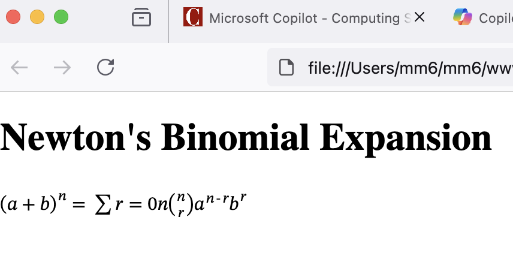
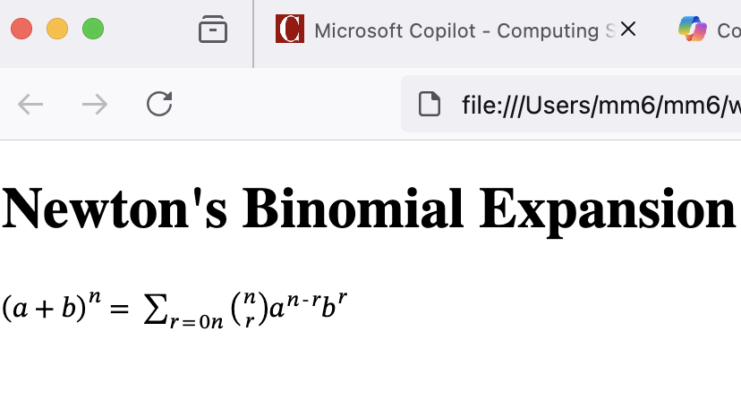
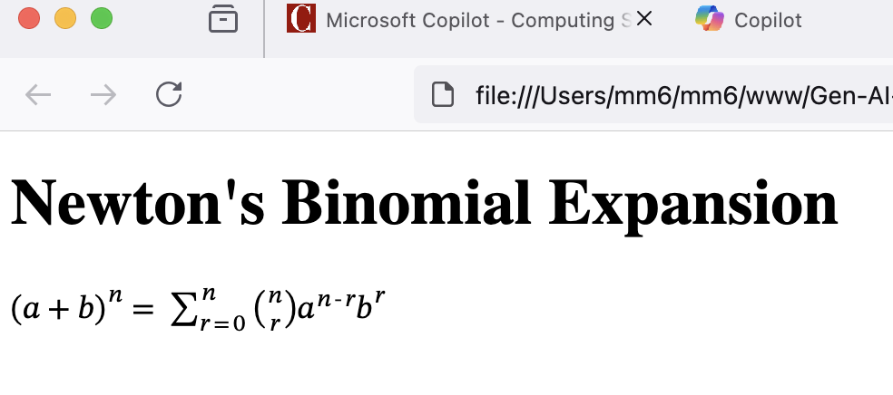

#  Unit29-Prompt-Patterns

## Introduction

The prompts in this unit are inspired by the paper "A Prompt Pattern Catalog to Enhance Prompt Engineering with ChatGPT"[1]. The pattern names are taken from that paper, and here we provide example prompts and responses based on those patterns.

For a complete explanation of each pattern, the reader should consult the paper[1].

## Use Case

## Prompts and Code Critique

We will show each prompt and the resulting code or response generated by Copilot. We will follow each example with a short critique and rating. The ratings will be Poor, Fair, or Good.

### Example 26.1 Meta Language Creation Pattern prompt: From now on, whenever I use one of the capital letters from this list: A,B,C,D,E,F,G,H, I am referring to a vertex in an directed graph. When I use an ordered pair I am referring to an edge in the graph. For example, if I use (C,D) then I am referring to a directed edge in the graph that goes from C to D. When I use an ordered triple the third element of the triple is the weight on an edge. So, for example, the edge denoted by (C,D,5) goes from C to D with a weight of 5.

### Example 26.1.1 Given the following graph, is there a path from A to F? (A,B),(B,C),(C,E),(E,D),(D,F) ?

### Generated response

```
Yes, there is a path from A to F in the given graph. Here’s the sequence of vertices you would follow:

Start at A
Move to B (via edge (A,B))
Move to C (via edge (B,C))
Move to E (via edge (C,E))
Move to D (via edge (E,D))
Finally, move to F (via edge (D,F))
So, the path from A to F is: A → B → C → E → D → F.
```

### Critique: Copilot allowed us to introduce notation to describe a directed, weighted graph. It also correctly answered a simple question about the existence of a path and produced the path itself. Rating: Good.

### Example 26.2 The Output Automater Pattern prompt: I am performing the following steps using the command line on my MAC. I would like the steps to be properly placed in a batch file. I am using the bash shell and want to execute the steps with one command. The only command line parameter will be the name of the directory whose README.md has been modified. Every time I work on a README.md file in a directory, I do the following from just above that directory:

git add MyModifiedDirectory

git commit -m "Made improvements to my unit"

git fetch origin

git merge origin/master -m "Some good commit message here"

git push origin master

### Generated Code
```
#!/bin/bash

# Check if the directory name is provided
if [ -z "$1" ]; then
  echo "Usage: $0 <directory>"
  exit 1
fi

DIRECTORY=$1

# Navigate to the parent directory
cd "$(dirname "$DIRECTORY")"

# Perform the git operations
git add "$DIRECTORY"
git commit -m "Made improvements to my unit"
git fetch origin
git merge origin/master -m "Some good commit message here"
git push origin master

To use this script:

Save the script to a file named update_readme.sh.
Make the script executable by running chmod +x update_readme.sh.
Execute the script with the directory name as a parameter, like this: ./update_readme.sh MyModifiedDirectory.

```
### Critique: This script and the included directions work. A minor concern is the inclusion of the line cd "$(dirname "$DIRECTORY")". This will make the current working directory the parent of the selected specified directory. This is fine but is unnecessary since we are executing these commands from just above the specified directory. It is more than what we requested and may cause confusion. Rating: Fair.

### Example 26.3 The Flipped Interaction Pattern prompt: From now on, I would like for you to ask me questions about a Java application that I would like to use to demonstrate cryptographic hashing. When you have enough information from me, please generate the solution.

### Generated Response
```
Got it! Let’s start by gathering some details about your Java application. Here are a few questions to get us going:

What specific cryptographic hashing algorithm would you like to demonstrate (e.g., SHA-256, MD5, etc.)?
What is the main purpose of your application? Is it for educational purposes, a specific project, or something else?
What kind of data will you be hashing (e.g., text, files, passwords)?
Do you have any specific requirements for the user interface? Should it be a console application, a GUI, or something else?
Are there any additional features you want to include, such as verifying hashes, comparing hashes, or generating salts?
Feel free to answer these questions, and we can proceed from there!

```
### Critique: These questions are all appropriate and would allow the tool to generate a Java solution. Rating: Good.

### Example 26.4 The Persona Pattern prompt: I would like to teach DOS commands to a linux user. Please pretend to be a linux terminal. When I type a linux command do two things: show the result of the command and provide the corresponding DOS command.

### Generated Code
```
Sent by you:
ls
Copilot
Sent by Copilot:
# Linux Terminal Output
file1.txt  file2.txt  directory1  directory2

DOS Command:

dir

Feel free to try another Linux command!

```
### Critique: Copilot acted as if it were a linux terminal and provided the corresponding DOS command. Rating: Good.

### Example 26.5 The Question Refinement Pattern prompt: From now on, whenever I ask a question, suggest a better version of the question to use instead. Prompt me if I would like to use the better version instead. Question: How can my IoT devices communicate with a wider variety of systems?

### Generated Code
```
Sure, I can help with that! Here’s a refined version of your question:

“What are the best methods to enable my IoT devices to communicate with a broader range of systems?”

Would you like to use this version instead?

```
### Critique: This pattern gives copilot a chance to propose a better question than that which was originally proposed. Rating: Fair

### Example 26.6 The Alternative Approaches prompt:

### Generated Code
```

```
### Critique

### Example 26.7 The Cognitive Verifier Pattern prompt:

### Generated Code
```

```
### Critique

### Example 26.8 The Fact Check List Pattern prompt:

### Generated Code
```

```
### Critique

### Example 26.9 The Template Pattern prompt:

### Generated Code
```

```
### Critique

### Example 26.10 The Infinite Generation Pattern prompt:

### Generated Code
```

```
### Critique

### Example 26.11.1 The Visualization Generator Pattern prompt: Newton's Binomial Expansion states that the quantity (a + b) to the n'th power is the sum, for r = 0 to n, of the quantity n choose r times a to the n minus r times b to the r. Please provide me with an html document, containing mathml, that shows Netwon's binomial expansion using sigma notation. I expect to be able to view the result in a browser with the label "Newton's Binomial Expansion". Thank you.

### Generated Code
```
<!DOCTYPE html>
<html lang="en">
<head>
    <meta charset="UTF-8">
    <meta name="viewport" content="width=device-width, initial-scale=1.0">
    <title>Newton's Binomial Expansion</title>
</head>
<body>
    <h1>Newton's Binomial Expansion</h1>
    <math xmlns="http://www.w3.org/1998/Math/MathML">
        <mrow>
            <msup>
                <mrow>
                    <mo>(</mo>
                    <mi>a</mi>
                    <mo>+</mo>
                    <mi>b</mi>
                    <mo>)</mo>
                </mrow>
                <mi>n</mi>
            </msup>
            <mo>=</mo>
            <mo>∑</mo>
            <mrow>
                <mrow>
                    <mi>r</mi>
                    <mo>=</mo>
                    <mn>0</mn>
                </mrow>
                <mrow>
                    <mi>n</mi>
                </mrow>
            </mrow>
            <mrow>
                <mrow>
                    <mo>(</mo>
                    <mfrac linethickness="0">
                        <mrow>
                            <mi>n</mi>
                        </mrow>
                        <mrow>
                            <mi>r</mi>
                        </mrow>
                    </mfrac>
                    <mo>)</mo>
                </mrow>
                <msup>
                    <mi>a</mi>
                    <mrow>
                        <mi>n</mi>
                        <mo>-</mo>
                        <mi>r</mi>
                    </mrow>
                </msup>
                <msup>
                    <mi>b</mi>
                    <mi>r</mi>
                </msup>
            </mrow>
        </mrow>
    </math>
</body>
</html>

```



### Critique: The HTML document contains mathml and, when loaded into a browser, shows Newton's Binomial Expansion. However, it does not show r = 0 to n on the summation symbol. Rating: poor.

### Example 26.11.2: In the answer that you provided, I cannot see r = 0 to r = n on the summation symbol. Please provide a better solution.

```
<!DOCTYPE html>
<html lang="en">
<head>
    <meta charset="UTF-8">
    <meta name="viewport" content="width=device-width, initial-scale=1.0">
    <title>Newton's Binomial Expansion</title>
</head>
<body>
    <h1>Newton's Binomial Expansion</h1>
    <math xmlns="http://www.w3.org/1998/Math/MathML">
        <mrow>
            <msup>
                <mrow>
                    <mo>(</mo>
                    <mi>a</mi>
                    <mo>+</mo>
                    <mi>b</mi>
                    <mo>)</mo>
                </mrow>
                <mi>n</mi>
            </msup>
            <mo>=</mo>
            <munder>
                <mo>∑</mo>
                <mrow>
                    <mrow>
                        <mi>r</mi>
                        <mo>=</mo>
                        <mn>0</mn>
                    </mrow>
                    <mrow>
                        <mi>n</mi>
                    </mrow>
                </mrow>
            </munder>
            <mrow>
                <mrow>
                    <mo>(</mo>
                    <mfrac linethickness="0">
                        <mrow>
                            <mi>n</mi>
                        </mrow>
                        <mrow>
                            <mi>r</mi>
                        </mrow>
                    </mfrac>
                    <mo>)</mo>
                </mrow>
                <msup>
                    <mi>a</mi>
                    <mrow>
                        <mi>n</mi>
                        <mo>-</mo>
                        <mi>r</mi>
                    </mrow>
                </msup>
                <msup>
                    <mi>b</mi>
                    <mi>r</mi>
                </msup>
            </mrow>
        </mrow>
    </math>
</body>
</html>

```


### Critique: The HTML/MathML loads into a browser but the variable n should appear on the top of the summation symbol. Rating: poor.

### Example 26.11.3 Please place the value n on top of the summation symbol.

```
<!DOCTYPE html>
<html lang="en">
<head>
    <meta charset="UTF-8">
    <meta name="viewport" content="width=device-width, initial-scale=1.0">
    <title>Newton's Binomial Expansion</title>
</head>
<body>
    <h1>Newton's Binomial Expansion</h1>
    <math xmlns="http://www.w3.org/1998/Math/MathML">
        <mrow>
            <msup>
                <mrow>
                    <mo>(</mo>
                    <mi>a</mi>
                    <mo>+</mo>
                    <mi>b</mi>
                    <mo>)</mo>
                </mrow>
                <mi>n</mi>
            </msup>
            <mo>=</mo>
            <munderover>
                <mo>∑</mo>
                <mrow>
                    <mi>r</mi>
                    <mo>=</mo>
                    <mn>0</mn>
                </mrow>
                <mi>n</mi>
            </munderover>
            <mrow>
                <mrow>
                    <mo>(</mo>
                    <mfrac linethickness="0">
                        <mrow>
                            <mi>n</mi>
                        </mrow>
                        <mrow>
                            <mi>r</mi>
                        </mrow>
                    </mfrac>
                    <mo>)</mo>
                </mrow>
                <msup>
                    <mi>a</mi>
                    <mrow>
                        <mi>n</mi>
                        <mo>-</mo>
                        <mi>r</mi>
                    </mrow>
                </msup>
                <msup>
                    <mi>b</mi>
                    <mi>r</mi>
                </msup>
            </mrow>
        </mrow>
    </math>
</body>
</html>
```



### Critique: This provides a nice display of the formula. Rating: Good


### Example 26.12 The Game Play Pattern prompt:

### Generated Code
```

```
### Critique
### Example 26.13 The Reflection Pattern prompt:

### Generated Code
```

```
### Critique

### Example 26.14 The Refusal Breaker Pattern prompt:

### Generated Code
```

```
### Critique


### Example 26.15 The Context Manager Pattern prompt:

### Generated Code
```

```
### Critique

### Example 26.16 The Recipe Pattern prompt:

### Generated Code
```

```
### Critique

### Example 26.17 The Recipe Pattern prompt:

### Generated Code
```

```
### Critique


## Exercises
1. Continue with Example 26.1 and ask Copilot to find the shortest path between two vertices in a graph. Use a larger graph than is shown in the example and include edge weights. Evaluate its performance as Poor, Fair, or Good.

2. Continue with Example 26.1 and ask Copilot to find the longest path between two vertices in a graph. Use a larger graph than is shown in the example and include edge weights. Note that the longest path problem is NP-Hard. Evaluate its performance as Poor, Fair, or Good.


## References
[1] White, Jules, Quchen Fu, Sam Hays, Michael Sandborn, Carlos Olea, Henry Gilbert, Ashraf Elnashar, Jesse Spencer-Smith, and Douglas C. Schmidt. “A Prompt Pattern Catalog to Enhance Prompt Engineering with ChatGPT.” arXiv (2023). https://doi.org/10.48550/arXiv.2302.11382
